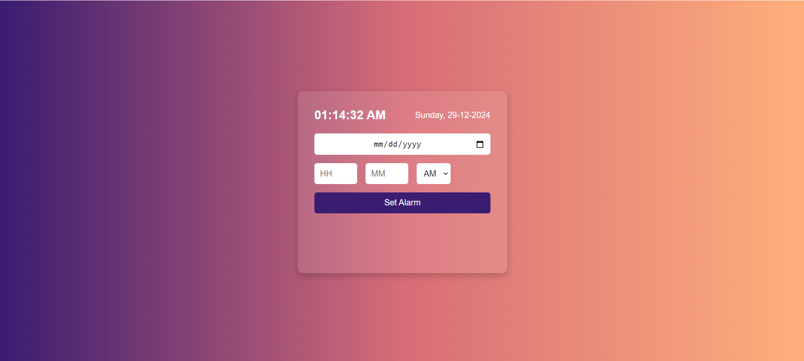

# Wake Up Buddy

## Overview
"Wake Up Buddy" is a modern and user-friendly alarm app designed to help you start your day on the right foot. With a clean and intuitive interface, this app focuses on ensuring you never miss an important wake-up. Whether you're a heavy sleeper or someone who needs a little extra motivation in the morning, Wake Up Buddy provides all the tools you need to set, manage, and customize your alarms effortlessly.

### Key Benefits:
- **Customizable Alarms**: Set multiple alarms with unique tones, repeat options, and snooze settings.
- **User-Friendly Interface**: Designed with simplicity in mind, making it easy to use for everyone.
- **Daily Routine & Organization**: Manage your schedule efficiently by setting and monitoring your alarms.
- **Reliable Notifications**: Ensures you’re up on time with clear visual and sound notifications.
- **Accessible & Flexible**: Ideal for busy individuals who need to keep track of time while managing a dynamic lifestyle.

## Features
- **Set Multiple Alarms**: Easily set and manage multiple alarms.
- **User-Friendly Interface**: Clean and modern design for a seamless user experience.
- **Date & Time Picker**: Set alarms with date and time selection.
- **Active Alarms Display**: View and manage active alarms.
- **Alarm Sound**: Alerts with customizable sound for better wake-up calls.

## How it looks:
### Basic Wake Up Buddy Interface
A screenshot showcasing the simple and intuitive design of the Wake Up Buddy app, featuring a clear layout with a time display, alarm settings, and delete options.

## Usage
1. Open the "Wake Up Buddy" app.
2. Set your desired alarm time and date.
3. Click "Set Alarm" to save.
4. Manage active alarms and delete as needed.

## Benefits
1. **Enhanced Productivity**: By ensuring you wake up on time, "Wake Up Buddy" helps improve your daily productivity.
2. **Personalized Experience**: Customize alarms to suit your preferences, from sound to snooze intervals.
3. **Improved Focus & Routine**: Establishing a consistent waking time fosters better focus and daily routine management.

## Future Enhancements
1. **Smart Notifications**: Add smart features such as weather-based alarms or personalized wake-up recommendations.
2. **Cross-Platform Support**: Extend the app to support more devices like tablets or desktops.
3. **Advanced Customization**: Introduce features like setting alarms based on activity (e.g., meetings, workouts).
4. **Improved UI/UX**: Optimize the interface for accessibility and better user interaction.

----
If you'd like to contribute to Wake Up Buddy, feel free to submit a pull request or report issues.

